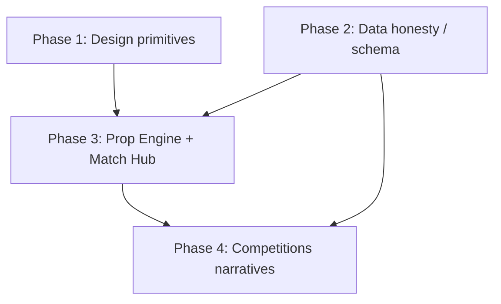

# EdgeBall A\* Blueprint

**Audit date:** 2026-10-05  
**Repo:** `/Users/georgeharrison/Documents/EB official`  
**Database:** Supabase project `EdgeBall PYTH` (`ijladlqcdmvmstgovvcf`, eu-west-2)  
**Goal:** Become an A\* statistical betting engine — priced narratives, neon edge, sportsbook UX — not a generic football data SaaS.

This document is an execution plan only. No UI code was written as part of this audit.

---

## Executive verdict

EdgeBall already has the right **data honesty** (no synthetic prices, `No Book Odds`, edge gated on model + price) and early sportsbook pieces (global slip, Match Hub prop board, Angle Filters, Poisson vs Book). The dominant chrome is still **light SaaS tables + encyclopedia pages**. Closing the A\* gap is less about new models and more about:

1. One visual betting language (odds pills, neon `+Edge`, market accordions).
2. Making every narrative a **priced action**.
3. Aligning UI to **tables that actually have rows** — and not pretending Last-5 / lineups / injuries exist when they are empty.

---

## 1. Design System & UI

### Current tokens (`src/app/globals.css`)

| Token | Value | Reality |
|-------|--------|---------|
| `--canvas` | `#f8fafc` | Used on `body` |
| `--ink` | `#0f172a` | Body text |
| `--muted` / `--line` | `#64748b` / `#e2e8f0` | Defined; components mostly hardcode hex |
| `--cobalt` / `--cobalt-dark` | `#2563eb` / `#1d4ed8` | **Unused as `var()`** |
| `--neon` | `#22d3ee` | Cyan appears as Tailwind hex, not CSS var |
| `--neon-edge` | `#34d399` | **Dead token** — never applied to `+Edge` |

Light mode only. System UI font. Sticky `thead` + row hover in globals reinforce **spreadsheet DNA**.

### What exists today

| Layer | Path | Assessment |
|-------|------|------------|
| Shell | `src/components/shell/AppShell.tsx`, `BetSlipDrawer.tsx` | Light canvas + floating slip — keep |
| Header | `src/components/site-header.tsx` | Nav pills; serviceable |
| Stats kit | `src/components/stats/*` | Right primitives; inconsistent styling |
| Dashboard | `src/components/dashboard/EdgeDashboard.tsx` | Closest to A\* value desk |
| Match Hub (live) | `src/app/fixtures/[id]/hub-*.tsx` | Betting board + hero odds — keep as canonical |
| Match Hub (legacy) | `src/components/MatchHub.tsx` | Dark tabbed hub — **not wired** to `/fixtures/[id]` |
| Prop Engine | `src/components/PlayerPropsBuilder.tsx` | Dense data grid — **primary SaaS offender** |
| Competitions | `src/app/competitions/advanced-table.tsx` | Multi-lens tables + accordion seed — still encyclopedia |

### Sportsbook-like vs SaaS-table-like

**Keep / amplify**
- Global `BetSlipProvider` + honest unpriced states
- Match Hub `@odds` CTAs (`hub-card-board.tsx`)
- Dashboard value cards + Poisson vs Book
- Angle filter language (Hot / Ref trap / Value)

**Refactor**
- Prop Engine 12-col sticky table → **market accordions / bet cards**
- Edge pills: cobalt/cyan mix → single **`--neon-edge` EdgeChip**
- Odds: bordered labels → **pressable price-dominant pills**
- Dual slips (global light + Prop Engine dark aside) → **one slip**
- Competitions accordion narrative without prices → **priced legs or hide**
- Fixture list model-% bars before prices → **ticket-first rows**
- Engineer copy (`edge_pct` in chrome) → user language; empty states may name the missing store when that is the real reason

### Target aesthetic (premium light sportsbook)

1. **OddsPill** — selection secondary, `@2.40` primary, full press target, disabled = `No Book Odds`.
2. **EdgeChip** — only when `modelProb != null && odds > 1 && edge > 0`; fill `--neon-edge` on dark ink.
3. **MarketAccordion** — Cards / SOT / Fouls / Goals / Match lines; collapse empty markets.
4. **BetCard** — Player · Market · season/clash/ref proof · Model vs Book · OddsPill.
5. Wire all colors through CSS vars; kill dead `--neon-edge` gap.
6. Reduce nested white cards on first viewport; one composition per screen.
7. **Honest empties** — section-level `EmptyReason`: `{human reason} ({source}).` e.g. `Referee assigned, but card averages not stored yet (fixture_statistics empty).` Never invent rows/odds/edge; do not spam table names on every cell dash.

### Components to refactor (priority)

| Priority | Component | Change |
|----------|-----------|--------|
| P0 | `PoissonVsBook.tsx` | Neon edge; pair with OddsPill sibling |
| P0 | New `OddsPill.tsx` / `EdgeChip.tsx` | Shared primitives |
| P0 | `PlayerPropsBuilder.tsx` | Accordion/card layout; remove dual slip |
| P1 | `hub-card-board.tsx` | Adopt shared primitives (stop reinventing edge UI) |
| P1 | `EdgeDashboard.tsx` | Neon edge; tighten hero copy |
| P1 | `AddToSlipButton.tsx` | Compact `@odds` density mode |
| P2 | `AngleFilters.tsx` | Drop emoji + `edge_pct` jargon |
| P2 | `MatchupClashBadge` / `StrictRefBadge` | Attach market CTA copy |
| P2 | `advanced-table.tsx` | Priced accordion or demote to research |
| P3 | Delete or quarantine `MatchHub.tsx` dark legacy | One Match Hub |

---

## 2. Data Reality Check

Live counts from PYTH (`pg_stat_user_tables` + targeted SQL), 2026-10-05.

### Population map

| Relation | Approx rows | Status | Powers |
|----------|-------------|--------|--------|
| `fixtures` | ~12.5k | **HAS DATA** | Match Hub, Prop Engine, fixtures board |
| `prematch_odds` | 2,723 (Bet365 `bookmaker_id=8`: 2,490) | **HAS DATA** | Prices for Hub / Props / Dashboard |
| `player_season_stats` | ~28k | **HAS DATA** | Season proof (fouls/90, yellows, SOT/90) |
| `standings` | 798 (40 leagues) | **HAS DATA** | Competitions lenses |
| `team_statistics` | ~1.5k | **HAS DATA** | Discipline / attacking lenses |
| `team_squads` | ~29k | **HAS DATA** | Player identity on boards |
| `player_profiles` / `players` | ~39k | **HAS DATA** | Names, photos |
| `predictions` / `custom_predictions` | 249 each | **HAS DATA** | Fixture model bars (secondary) |
| `leagues` / `teams` / `venues` | filled | **HAS DATA** | Reference |
| `top_*` leaderboards | ~800–900 | **HAS DATA** | Competitions rankings |
| `fixture_player_statistics` | **0** | **EMPTY** | Last-5 form / hot streaks / SOT overdue |
| `fixture_statistics` | **1,174** | **HAS DATA** | Team match sheets + referee card rates |
| `team_match_sheet_totals` | **192** | **HAS DATA** (view) | xG / corners per game |
| `fixture_events` | **0** | **EMPTY** | Live/event feeds |
| `fixture_injuries` / `match_injuries` | **0** | **EMPTY** | Injury narratives |
| `live_odds` | **0** | **EMPTY** | In-play |
| `fixture_lineups` | **2** | **NEAR-EMPTY** | Lineup tabs |

### Schema drift (critical)

These relations are **absent on PYTH** (`to_regclass` → null). Loaders must not query them:

| Expected object | Status | Replacement |
|-----------------|--------|-------------|
| Table `referee_summary` / `referee_prop_summary` | **MISSING** | `loadRefereeRates` → `fixtures` + `fixture_statistics` |
| Table `player_prop_summary` | **MISSING** | `player_season_stats` aggregation |
| Table `league_table_advanced` | **MISSING** | `loadStandingsLenses` → standings / team_statistics / PSS |

`src/types.ts` is regenerated from live PYTH (no ghost summary tables).

**A\* rule:** UI must degrade to muted empty states when data is absent; never invent odds/edge.

### `prematch_odds` detail (Bet365)

| Metric | Value |
|--------|-------|
| Rows with `model_prob` / `edge_pct` columns set | **16 / 2,723** Bet365 |
| Player props with `player_id` in values | Dominated by **Player to be Booked** (~17 bet rows, ~750 values); only ~5 of those have `model_prob` on values |
| Match markets (1X2, BTTS, O/U, etc.) | Abundant |
| Player SOT / shots / fouls as structured `player_id` props | **Sparse / not in player_id shape** — names appear on goalscorer & shot markets without reliable `player_id` |
| Sync writer | `src/scripts/sync-odds-api-io.ts` writes price fields; **does not invent model** |
| Edge writer | `src/scripts/calc-edges.ts` Poisson card edges into `odds_data` values + row columns |

**Implication:** Match Hub multi-market tabs for SOT/Fouls/Goals will stay empty until sync maps those bets with `player_id` (or a name→id resolver). Cards + match lines are the real board today. Dashboard “value bets” will be thin until `calc:edges` coverage grows beyond ~30 rows.

### Page → table wiring

#### Match Hub (`/fixtures`, `/fixtures/[id]`)

| Need | Table / source | Reality |
|------|----------------|---------|
| Fixture identity | `fixtures`, `teams`, `leagues`, `venues` | OK |
| Match odds (1X2, BTTS, O/U) | `prematch_odds` (Bet365) | OK |
| Player prop board | `prematch_odds.odds_data` player bets | Cards OK (sparse); SOT/Fouls/Goals weak |
| Season proof | `player_season_stats` | OK |
| Strict ref | Derived via `utils/stats/referees` (fixture referee + rates) | Partial — depends on stored rates |
| Foul collision | `player_season_stats` / team fouls | Partial |
| Last-5 / form dots | `fixture_player_statistics` | **EMPTY — must not be primary proof** |
| Lineups / injuries | `fixture_lineups`, `fixture_injuries` | Empty |

Loader of record: `src/app/fixtures/[id]/hub-load.ts` → `propBoard`.

#### Prop Engine (`/props`)

| Need | Table / source | Reality |
|------|----------------|---------|
| Board | `loadBuilderBoard` → `builder/load.ts` | OK path |
| Prices | `prematch_odds` | OK when present |
| Model edge | `model_prob` / `edge_pct` in odds JSON or computed | **Sparse** |
| Season rates | `player_season_stats` | OK |
| Hot / SOT overdue angles | `fixture_player_statistics` via form | **EMPTY → angles hide** |
| Ref traps | referee rates + high foul side | Partial |

#### Competitions (`/competitions`, `/competitions/[leagueId]`)

| Need | Table / source | Reality |
|------|----------------|---------|
| Standings | `standings` | OK |
| Lenses (discipline/attack) | `team_statistics` + `player_season_stats` | OK |
| xG / corners sheets | `team_match_sheet_totals` | **MISSING on PYTH** |
| BTTS / streak views | derived from fixtures/standings | Partial |
| Rankings | `top_scorers`, etc. | OK |
| Player/team wiki | profiles, trophies, transfers | OK but **not A\* core** |

---

## 3. Betting Narratives (The A\* Standard)

**A\* definition:** Every primary UI unit answers: *What do I bet? At what price? Why does the model/season/matchup say yes?*  
Naked rate badges without a selection are research, not the product.

### Stats kit scorecard

| Component | File | Verdict | Current | A\* target |
|-----------|------|---------|---------|------------|
| PoissonVsBook | `stats/PoissonVsBook.tsx` | Partial → Actionable | Model % vs Implied; cobalt edge | Neon EdgeChip + OddsPill sibling |
| AddToSlipButton | `stats/AddToSlipButton.tsx` | Actionable | Honest `@odds` / No Book Odds | Compact sportsbook density |
| AngleFilters | `stats/AngleFilters.tsx` | Framing OK | Emoji + `edge_pct` leak | Short chips: Hot / Ref trap / Value |
| MatchupClashBadge | `stats/MatchupClashBadge.tsx` | Naked | `draws 2.4/g vs 2.1/g-foul` | “Clash → take Fouls Drawn / Card @X” |
| StrictRefBadge | `stats/StrictRefBadge.tsx` | Naked | Cards/game profile | “Strict ref → open Card props” |
| HitRateStrip | `stats/HitRateStrip.tsx` | Naked (blocked by empty table) | Dots / Last-5 not stored | Secondary under season proof until FPS backfilled |
| GameScriptBadge | `stats/GameScriptBadge.tsx` | Naked | Label only | Script → market CTA |
| CardMeter | `stats/CardMeter.tsx` | Naked | Combined cards gauge | Tie to priced Over cards or remove from list |
| PlayerBreakdown | `stats/PlayerBreakdown.tsx` | Naked SaaS | Match log grid | Collapse under “Proof”; color vs line |
| LensPills | `stats/LensPills.tsx` | Chrome | Generic | Fine once labels are bet-first |
| Hub season badges | `hub-card-board.tsx` | Partial | `1.8 fouls/90` | Keep as proof **under** priced selection |
| Dashboard value cards | `EdgeDashboard.tsx` | Mostly Actionable | Season badges + Poisson + Add | Neon edge; bury unpriced hot streaks |

### Product surfaces

| Surface | Verdict | Gap |
|---------|---------|-----|
| `/` Dashboard | Closest to A\* | Neon; hot streaks often unpriced |
| `/fixtures/[id]` Match Hub | Core board good | Season badges > narrative CTAs; sparse non-card markets |
| `/props` Prop Engine | Spreadsheet desk | Must become bet cards / accordions; one slip |
| `/competitions/[id]` | Research portal | Accordion needs priced BTTS/cards or stay demoted |
| Player/team pages | Encyclopedia-first | Betting angle owns first viewport |
| Legacy `MatchHub.tsx` / `MatchHero` | Split brain / inert CTA | Unify or delete |

### Narrative rules (non-negotiable)

1. **Never invent edge** from hit-rate (dashboard/load + PoissonVsBook already fixed — keep).
2. **Season proof > empty Last-5** until `fixture_player_statistics` is backfilled.
3. **Badge without price** is secondary chrome, not the card hero.
4. **Empty markets hide** (tabs/angles), never fake rows.
5. **Name the missing source** in section-level empty states when that is the real reason (e.g. `prematch_odds`, `fixture_statistics`). Keep muted slate copy; never invent rows/odds/edge. Do not spam table names on every cell dash.

---

## 4. Implementation Order — 4 Isolated Phases

Each phase is one agent session. Do not start the next until the previous is mergeable. No cross-phase drive-by refactors.

### Phase 1 — Design system primitives (no page rewrites)

**Goal:** One betting visual language.

**Ship**
- Wire `var(--cobalt)`, `var(--neon)`, `var(--neon-edge)` through stats kit.
- Add `OddsPill`, `EdgeChip` (or equivalent) under `src/components/stats/`.
- Update `PoissonVsBook` + `AddToSlipButton` to use them.
- Clean `AngleFilters` labels (no emoji / no `edge_pct` text).
- Document usage in a short comment block in `stats/index.ts`.

**Do not**
- Rewrite Prop Engine layout or Competitions tables.
- Touch ingest/sync scripts.

**Done when:** Dashboard + Hub + Props share neon edge + odds pill styling without layout changes.

---

### Phase 2 — Data honesty & schema alignment

**Goal:** Code and PYTH agree; UI never depends on empty/missing relations for primary proof.

**Ship**
- Re-apply or recreate missing `team_match_sheet_totals` / `referee_summary` / `player_prop_summary` **or** remove dead queries and guard with soft-fail.
- Regenerate / fix `src/types.ts` against live PYTH.
- Audit loaders that assume `fixture_player_statistics` form; ensure all hot/SOT angles hide cleanly at 0 rows.
- Expand `calc-edges` runbook note: current coverage ~30 rows — document how to refresh.
- Optional: name→`player_id` resolver spike for goalscorer / SOT markets (design only or minimal util) — full sync expansion can wait.

**Do not**
- Redesign Prop Engine or competitions UI in this phase.

**Done when:** No loader 500s on missing views; empty Last-5 never presented as primary proof; types match live DB.

---

### Phase 3 — Prop Engine + Match Hub as sportsbook boards

**Goal:** Primary betting surfaces feel like a desk, not a CRM.

**Ship**
- Rebuild `PlayerPropsBuilder` to market accordions / BetCards; remove dual dark slip (use global drawer only).
- Hub board adopts shared OddsPill / EdgeChip / proof badge patterns.
- Clash + Strict Ref badges gain CTA copy that filters/opens the relevant market.
- Fixture list rows: kickoff + odds pills + top edge link into Hub (demote raw model bars).
- Quarantine unused `MatchHub.tsx` / inert `MatchHero` Add button.

**Do not**
- Rebuild full competitions wiki or player encyclopedia.

**Done when:** `/props` and `/fixtures/[id]` are the same visual language; one slip; every visible prop row is selection + proof + price/edge or honest empty.

---

### Phase 4 — Competitions as bet-led lenses + narrative close-loop

**Goal:** League pages help you bet today’s board, not browse a wiki.

**Ship**
- Advanced table accordion: attach stored Bet365 BTTS / cards / O-U when available; else muted “No Book Odds”.
- League landing: promote “Open Match Hub” + value angles; demote trophies/transfers below fold on player pages.
- Wire GameScript / CardMeter to priced markets or remove from high-traffic lists.
- Copy pass: all empty states user-facing.
- Stretch (only if Phase 2 data allows): kick off `fixture_player_statistics` backfill job — unlock real Last-5.

**Do not**
- Expand Odds-API market catalog in the same session as UI polish unless blocked.

**Done when:** Competitions lenses feel like a path into priced Hub/Props, not an encyclopedia.

---

## Phase dependency graph

Phases 1 and 2 can run sequentially in either order; **prefer 1 then 2** so visual tokens exist before board rewrites. Phase 3 requires both. Phase 4 requires Phase 3 patterns + Phase 2 data guards.

---

## Out of scope for this blueprint (explicit)

- Writing UI/code in the audit pass (this file only).
- Expanding Odds-API sync to full SOT/Fouls/Goals `player_id` markets (called out as data dependency).
- Live betting / `live_odds` product.
- Dark mode.
- Rebuilding `/tracker`, Stripe checkout, or worker cadence.

---

## Source anchors

| Area | Key paths |
|------|-----------|
| Tokens | `src/app/globals.css`, `src/app/layout.tsx` |
| Stats kit | `src/components/stats/*` |
| Shell / slip | `src/components/shell/*` |
| Dashboard | `src/app/dashboard/load.ts`, `src/components/dashboard/EdgeDashboard.tsx` |
| Match Hub | `src/app/fixtures/[id]/hub-load.ts`, `hub-card-board.tsx`, `hub-view.tsx` |
| Prop Engine | `src/app/props/page.tsx`, `src/app/builder/load.ts`, `src/components/PlayerPropsBuilder.tsx` |
| Competitions | `src/app/competitions/data.ts`, `standings-load.ts`, `advanced-table.tsx` |
| Odds / edges | `src/scripts/sync-odds-api-io.ts`, `src/scripts/calc-edges.ts` |
| Types | `src/types.ts` (stale vs live on summary views) |
| Migrations (not all on PYTH) | `supabase/migrations/*` |

---

## Bottom line

**Build the sportsbook chrome and close the narrative→price loop on data we already have** (`prematch_odds` + `player_season_stats` + `standings`). Treat empty match-stat tables and missing summary views as hard constraints, not UI bugs. Four phases keep each agent run focused and timeout-safe.
